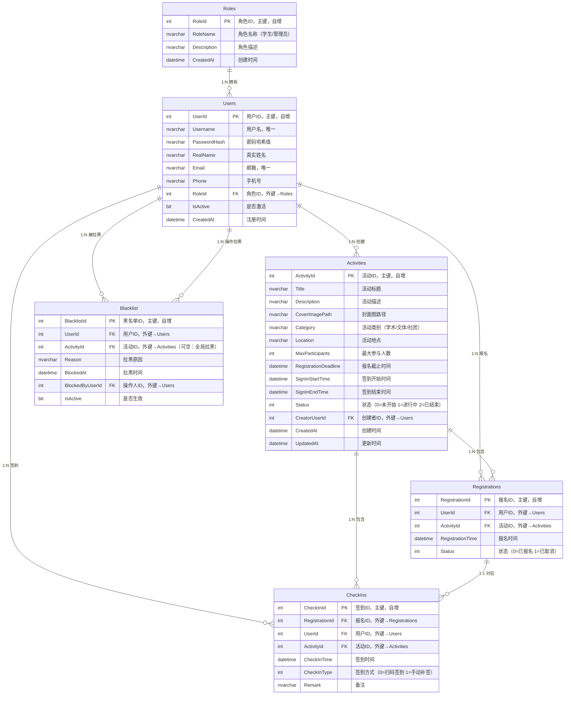

# 校园活动管理系统 - 数据库E-R图

## 实体关系图

## 关系说明

| 父表 | 子表 | 关系 | 说明 |
|------|------|------|------|
| Roles | Users | 1:N | 一个角色下有多个用户 |
| Users | Activities | 1:N | 一个管理员可创建多个活动 |
| Users | Registrations | 1:N | 一个用户可报名多个活动 |
| Users | CheckIns | 1:N | 一个用户可多次签到 |
| Users | Blacklist | 1:N | 一个用户可被拉黑多次 |
| Activities | Registrations | 1:N | 一个活动可被多人报名 |
| Activities | CheckIns | 1:N | 一个活动关联多条签到记录 |
| Registrations | CheckIns | 1:1 | 一条报名记录对应一次签到 |

## 设计要点

1. **报名唯一约束**：Users + Activities 联合唯一索引，防止一人重复报名同一活动。
2. **签到关联报名**：CheckIn 表通过 RegistrationId 关联报名记录，并通过 Users + Activities 联合唯一约束防止同一活动重复签到。
3. **黑名单灵活性**：ActivityId 可为 NULL，支持全局拉黑（所有活动）或针对特定活动拉黑。
4. **状态字段**：Activities.Status 由 SQL Server 定时作业或后端服务根据时间自动更新。
5. **密码安全**：PasswordHash 存储 BCrypt/SHA256 哈希值，不存储明文密码。
